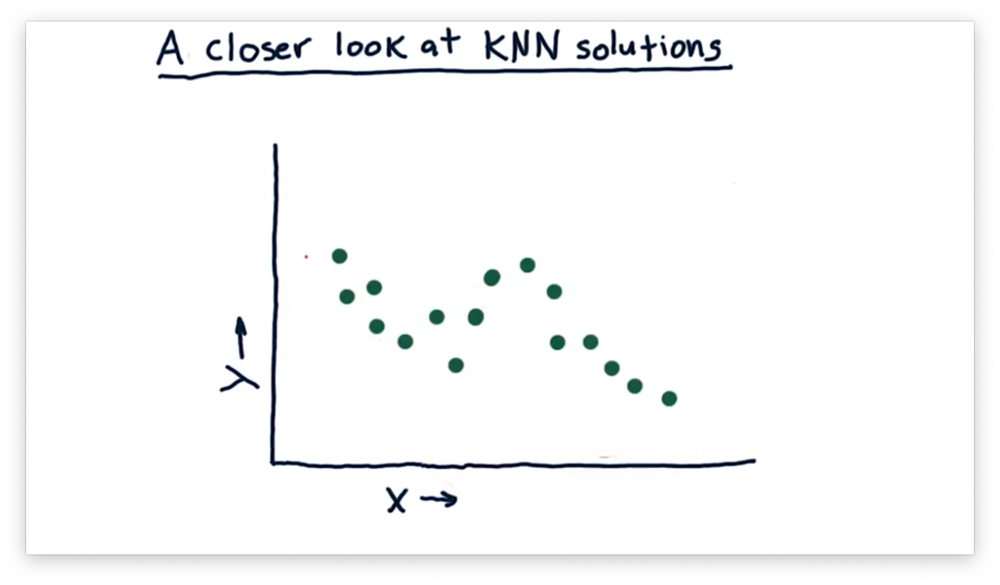
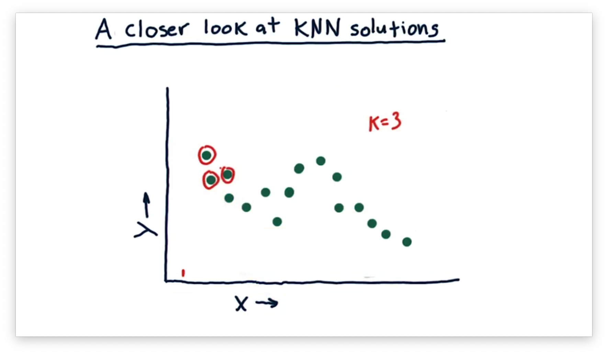
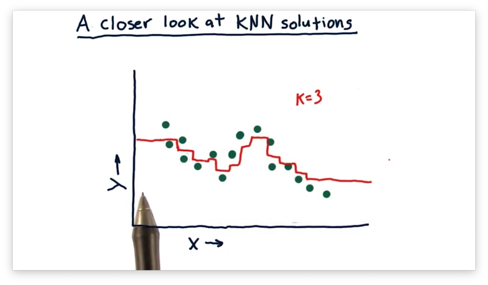
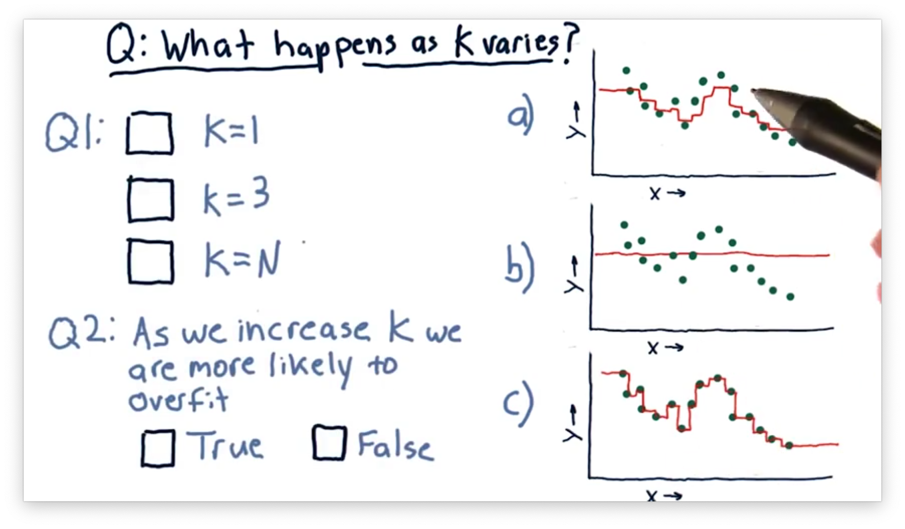
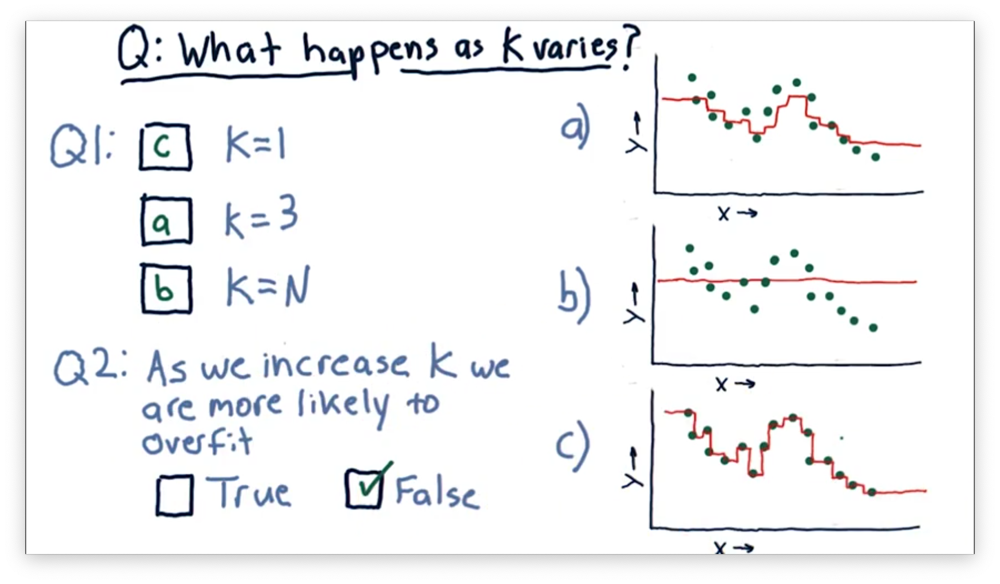
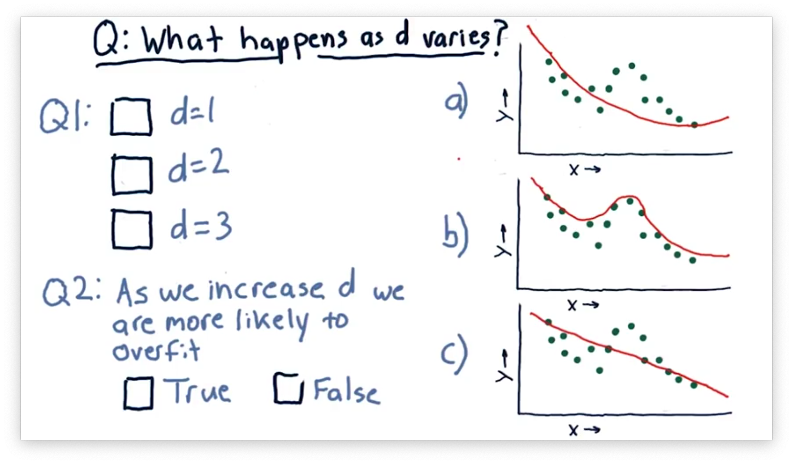
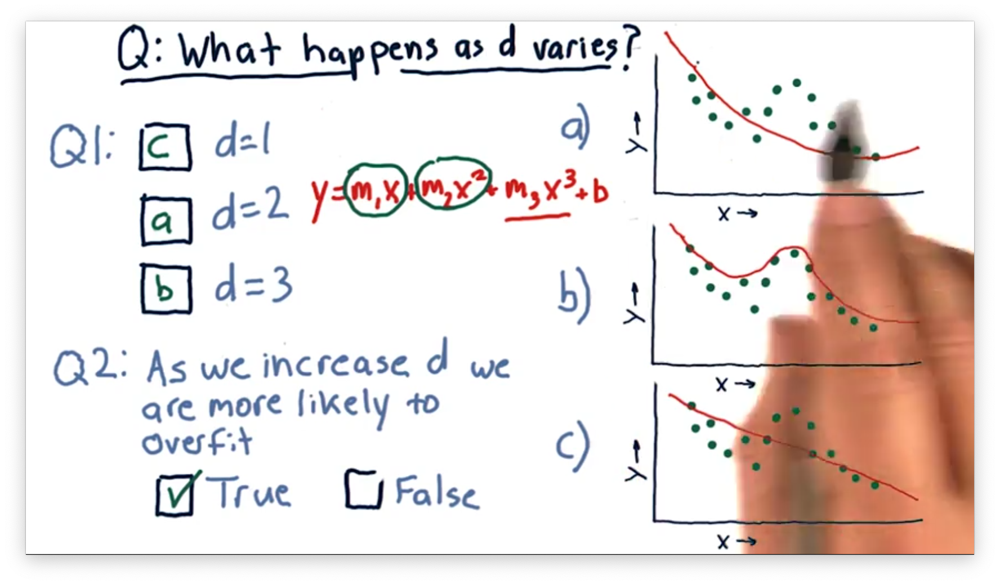

# Assessing a Learning Algorithm

## A Closer Look at KNN Solutions

Assume we have the following training examples plotted below, and we want to use the KNN algorithm to provide predictions for new observations.

Now suppose we query the KNN model at the following point, near $x = 0$, using the three nearest neighbors to make our prediction.

We calculate the predicted $y$ value for this $x$ as the mean of the $y$ values of these three neighbors. As $x$ gets larger, the set of nearest neighbors, and therefore the predicted $y$ value, shifts. We can plot the predicted $y$ values throughout the following continuous range of $x$ values.

A helpful feature of this model is that it doesn't overfit the data. Since we consider multiple neighbors for each prediction, a prediction is never disproportionately influenced by a single training example.

However, this model is not without its shortcomings. For example, we see flat lines at either end of the plot. After a certain point, the model returns the same prediction for any $x$ because the neighbors don't change. In other words, the model is unable to extrapolate any trends present in the data.

## What Happens as K Varies Quiz

Consider the following three models, each generated using a different value for $K$.

Our first task is to match the value of $K$ with the corresponding plot. Our second task is to decide whether we increase the chances of overfitting as we increase $K$. A **overfit** model matches the training set very well but fails to generalize to new examples.

## What Happens as K Varies Quiz Solution

Let's consider the case where $K = 1$. In this case, the model passes through every point $P$ directly, since near $P$, the only point that has any influence is $P$.

Now consider the case where $K = N$. In this case, every point considers all of the neighbors. Thus, the generated model is a straight line passing through the mean of the $y$ values of all the points.

Of course, when $1 < K < N$, the graph lies between these two extremes. For $K = 3$, the graph roughly follows the points without passing through them directly.

As a result, we see that increases in $K$ decrease the probability of overfitting.

## What Happens as D Varies Quiz

Consider the following three polynomial models. The difference between each model is the [degree of the polynomial](https://en.wikipedia.org/wiki/Degree_of_a_polynomial) $d$.

Our first task is to match the value of $d$ with the corresponding plot. Our second task is to decide whether we increase the chances of overfitting as we increase $d$.

## What Happens as D Varies Quiz Solution

A polynomial of degree one matches the equation $y = m_1x + b$, which is the equation of a line and corresponds to the third plot.

A polynomial of degree two matches the equation $y = m_1x + m_2x^2 + b$, which is the equation of a parabola and corresponds to the first plot.

A third-order polynomial matches the equation $y = m_1x + m_2x^2 + m_3x^3 + b$, which corresponds to the second plot.

We see that as we increase $d$, our model begins to follow the points more closely. Indeed, it can be shown that for $N$ points, a parabola of degree $N$ exists that passes through each point.

Notice that for each of these models, we can extrapolate beyond the data given. This ability to extrapolate is a property of parametric models that instance-based models lack.