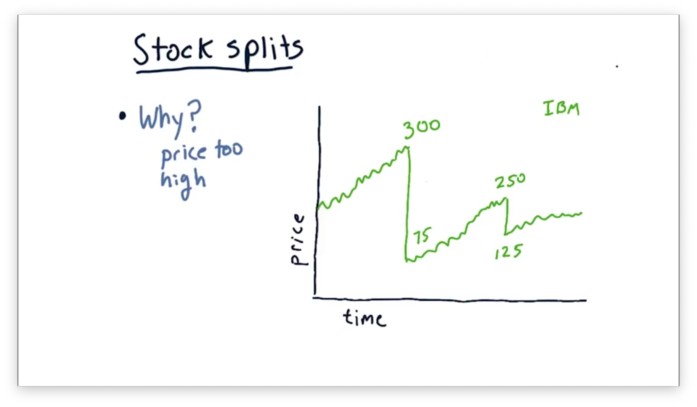
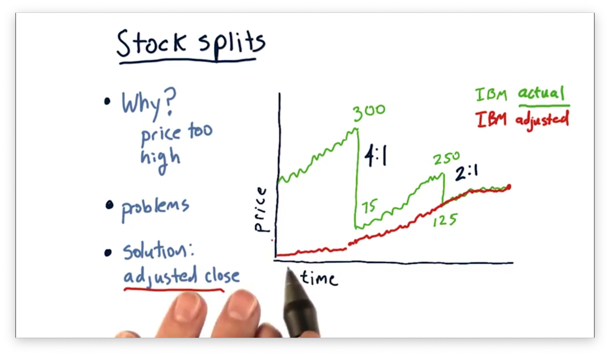
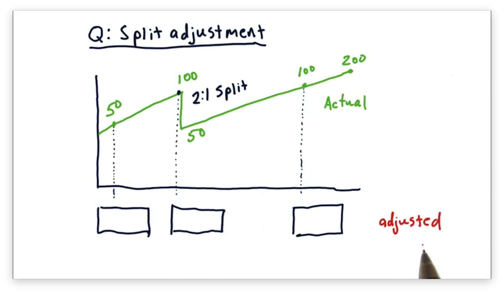
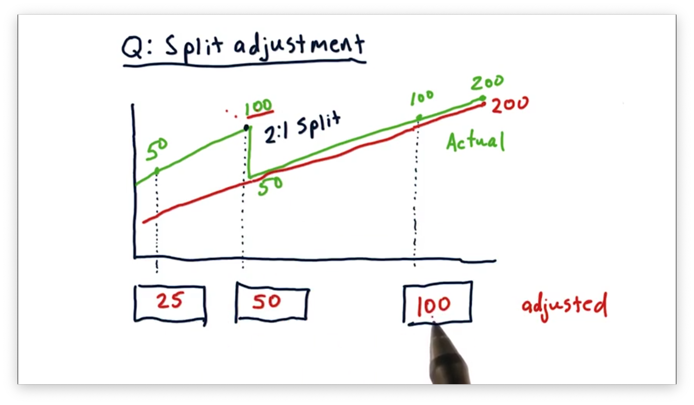
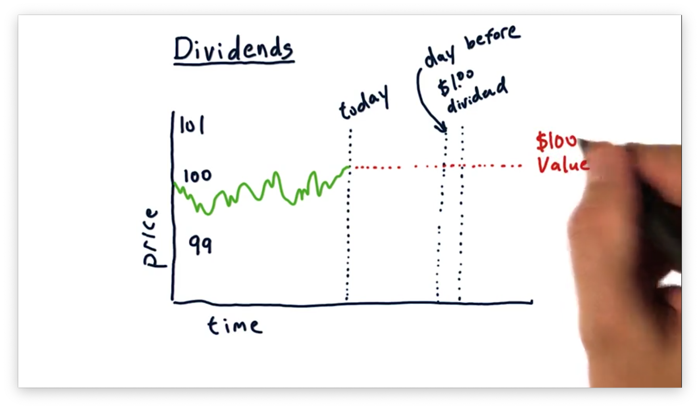
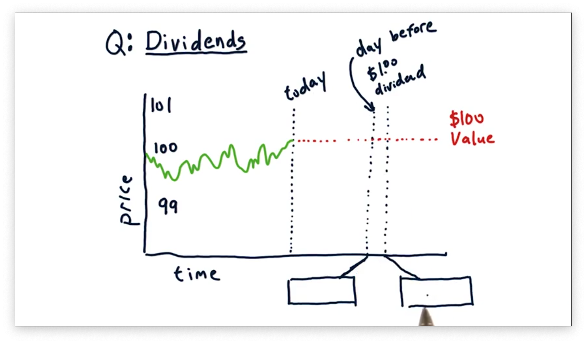
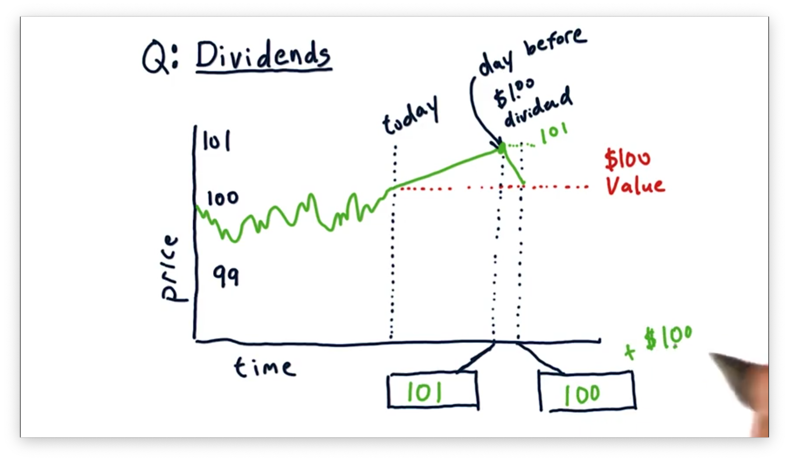

# Dealing With Data

## How Data Is Aggregated

Many stocks are being traded across many different exchanges, and it's essential to understand how that data is aggregated and reported to us so that we can consume it appropriately.

The finest resolution of data is a tick. A **tick** represents a successful match between a buyer and a seller: in other words, a successful transaction.

Consider the following plot, which shows share price along with share volume over time.

Keep in mind that none of these transactions happens at a specific time or during a specific time slice. There is no guarantee regarding the number of ticks during any particular minute or hour. An exchange only records a tick when a successful transaction occurs.

Each exchange provides its own data feed regarding these transactions, and we can subscribe to multiple feeds to see ticks across different markets.

Let's add in the ticks from another exchange, shown in red, to our plot. Remember that all of these transactions are happening simultaneously, and prices at different exchanges aren't guaranteed to be the same.

Highly liquid stocks might experience hundreds of thousands of transactions occurring every second. Collecting ticks across all of the exchanges over a long period of time for stocks like these might result in an incomprehensible amount of data.

As a result, exchanges usually consolidate tick data into time slices - minute-by-minute or hour-by-hour, for example - and we can see such slices, demarcated by the dotted lines, in our plot.

We can describe each chunk using five data points: open, high, low, close, and volume. Let's consider the first chunk.

The **open** is the price of the first transaction within the chunk, which is $100.00. The **high** is the highest transaction price within the chunk, which is also $100.00. The **low** is the lowest transaction price within the chunk, which is $99.05. The **close** is the price of the last transaction within the chunk, which is $99.50. Finally, the **volume** represents the total number of shares transacted within the chunk, which is 600.

We can similarly consolidate the next chunk. Both the open and the low are $99.00, while the high and the close are $99.95. The volume is 300.

The data that we are going to work with is daily data; in other words, we are working with chunks that aggregate ticks on a daily frequency.

All of the concepts that we discuss apply to finer time slices, such as milliseconds, but analyzing and acting on chunks of this size requires faster computers and larger databases than we have access to in this course.

## Price Anomaly Quiz

Consider the following plot of IBM stock prices over time.

Notice the sudden drops in price. In one example, the price drops from $300 per share to $75 per share; in another, the price drops from $250 per share to $125 per share. These drops represent a 75% and a 50% price decline, respectively.

Undoubtedly, the value of IBM did not drop that much in one day, so, which of the following reasons might explain the sudden drop in stock price?

## Price Anomaly Quiz Solution

What we see here is a **stock split**, whereby a single share becomes $n$ shares, and the price of each share is divided by $n$.

For example, consider the drop in price from $300 per share to $75 per share. This 75% drop in price is consistent with a 4-for-1 stock split, whereby one share becomes four shares. Note that the total value of the shares is preserved - four $75 shares still equals $300 worth of IBM - but the number of overall shares has increased.

## Stock Splits

The most common reason for a company to issue a stock split is to drive down the share price. Naturally, that begs the question: why is a high share price a problem?

Consider a stock with a high share price, such as $500. Investors generally buy stocks in groups of one hundred - referred to as a **lot**. At $500 per share, a lot costs $50,000, and some investors might find this price prohibitively expensive. Additionally, share price impacts derivative securities, like stock options, which typically control lots, and can make them more expensive and less liquid.

As well, investors often strive to build portfolios with finely-tuned proportions allocated to each stock. If some of the stock in the portfolio have very high share prices, such fine resolution may be difficult to achieve.

Let's look at two stock splits.

Here we see a 4:1 stock split, whereby one share becomes four, and the resulting stock price is quartered. As well, we see a 2:1 stock split, which involves a doubling of the share count and a halving of the share price.

Suppose we feed this pricing data into a computer and ask it to find trading opportunities. As we might expect, the algorithm is likely to find fantastic shorting opportunities on the days before each split!

Of course, that strategy is incorrect, as the value of the company hasn't actually decreased; instead, the number of shares of the company are increasing, and the price per share is adjusting to account for that increase. If we want to trade using the actual close data, we need to account for these splits.

The solution to this problem is to use **adjusted close** instead of close. Adjusted close retroactively accounts for stock splits and provides a measure of split-adjusted price movement that gives investors - and computers - a less turbulent view of the share price over time.

Here's how it works. We walk back in time, day by day, setting adjusted close equal to actual close until we encounter the most recent $n$:1 stock split. From that point back to the beginning of time, we set the adjusted close equal to the actual close divided by $n$.

For our example, we divide all close prices leading up to the 2:1 split by two and all close prices leading up to the 4:1 split by four. Notice that the values leading up to the 4:1 split are effectively divided by eight, to account for both splits.

By computing the adjusted close, we now have a smooth line representing the split-adjusted stock price, and we no longer have to account for stock splits explicitly. Additionally, we can look back into the past - several splits ago - and accurately understand the accumulation of value between then and now.

## Split Adjustment Quiz

Consider the following plot of close prices for a particular stock over time. Notice the 2:1 stock split. For each of the three days identified below, what is the adjusted close price for this stock?

## Split Adjustment Quiz Solution

For each day since the stock split, the adjusted close is equivalent to the actual close. As a result, the adjusted close for the most recent of the three days is $100.

For all days before the 2:1 split, we calculate the adjusted close by dividing the actual close by two. As a result, the adjusted close prices for the previous two days, moving backward from the split, are $50 and $25, respectively.

Consider buying one share of stock, on the first of the three days, for $50. After the split, we would have two shares, each worth $50, and by the third day, our shares would be worth $100 apiece. This trajectory represents a four-fold increase in value, from $50 to $200 worth of stock.

Note that using the adjusted close accurately reflects this quadrupling of value, whereas the actual close seems to indicate, incorrectly, only a doubling of value.

## Dividends

Many companies regularly pay dividends to their shareholders. For example, a company might pay a 1-2% dividend per share per year. For a stock trading at $100 per share, this dividend equals $1-2.

Dividend payments can have significant effects on a stock's price. Consider a company whose stock is currently trading at around $100 per share and for which investors have derived a fundamental value of exactly $100 per share. Let's suppose that this stock has an upcoming dividend payment of $1.

## Dividends Quiz

What share price do we expect to see the day before the dividend is paid? How about after the dividend is paid?

## Dividends Quiz Solution

The day before the dividend is paid, we should expect to see the stock price rise to $101. A share price of $101 reflects the underlying value of $100 per share, for which there is consensus, plus the expected $1 dividend payment.

On the very next day, we should expect the price to drop by $1 to $100 per share. Since the dividend has been paid, the share price should drop back down to the price aligned with its fundamental value: $100 per share.

Note that the overall value for investors who bought before the dividend was paid is still $101 per share: $100 per share plus $1 in cash per share.