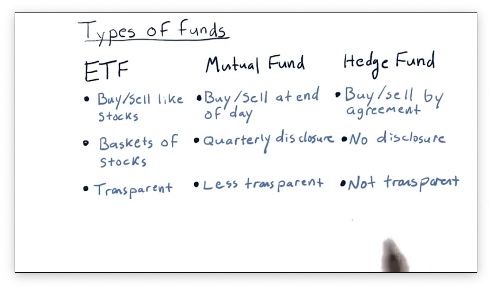
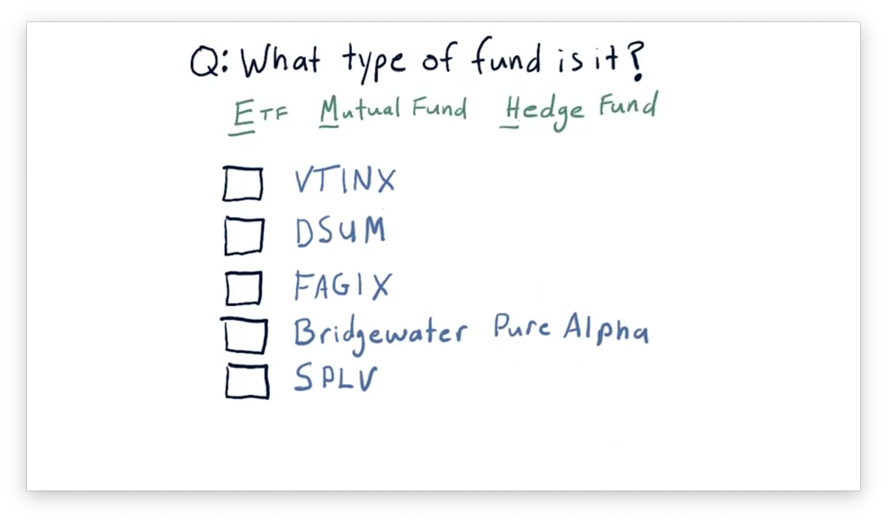
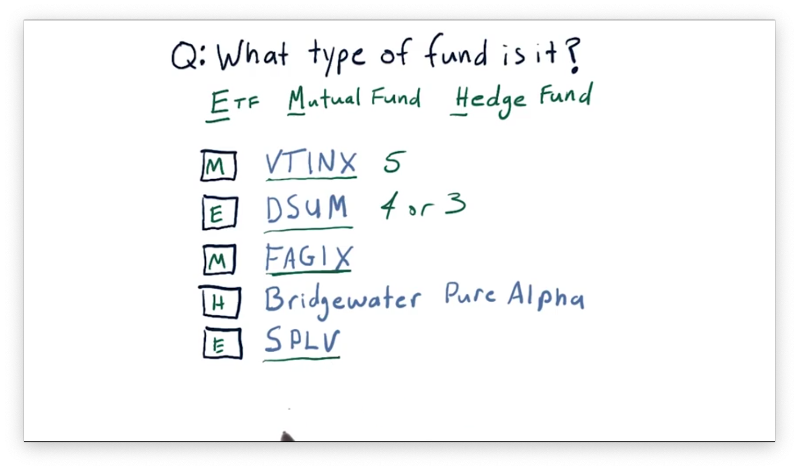
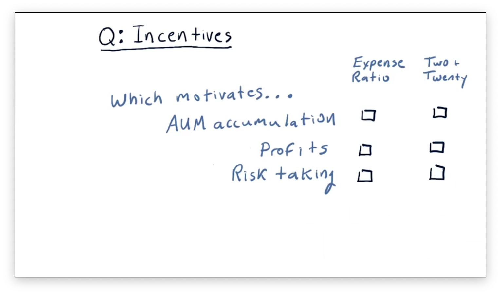
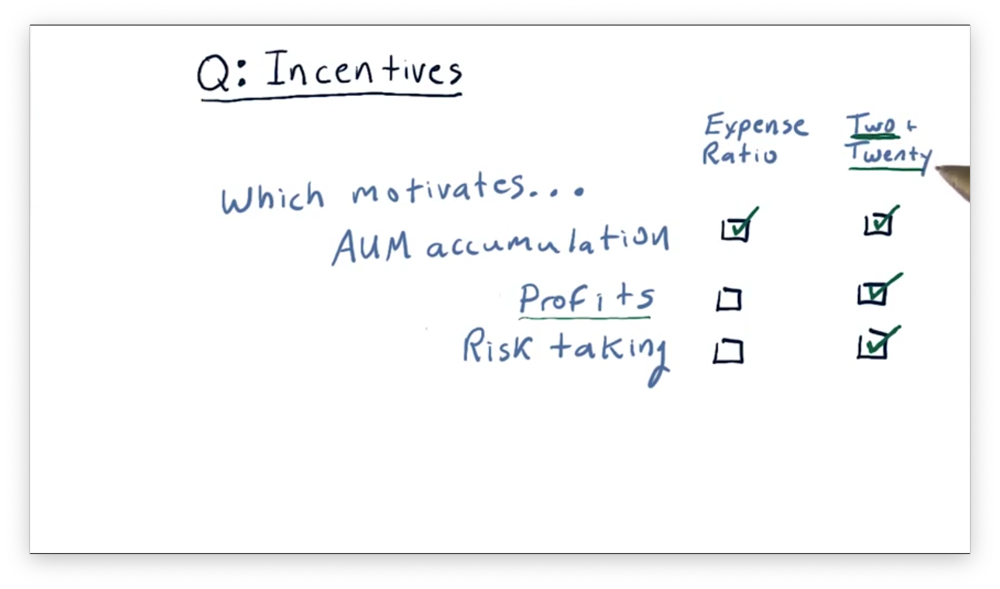

# So You Want to be a Hedge Fund Manager

## Types of Funds

There are many different types of funds, but three broad classes that we are going to look at are **exchange-traded funds** (ETFs), **mutual funds**, and **hedge funds**.

ETFs represent baskets of stocks, yet can be bought and sold as if they were individual stocks. ETF prices change throughout the day, and we can buy or sell ETF shares whenever the market is open. In other words, ETFs are very liquid. Additionally, ETF managers are very transparent concerning investment goals - for instance, tracking the S&P 500 - and holdings.

Mutual funds are less liquid than ETFs. At the end of the trading day, a mutual fund adds up all of its holdings to compute a *net asset value*, and its from this value that the buy/sell price is derived. Unlike ETFs, which investors can trade intraday, mutual funds can only be bought or sold at the end of the day.

Additionally, mutual funds are less transparent then ETFs. Mutual funds only have to disclose their holdings once every quarter. As a result, investing in a mutual fund can be somewhat of a black box in the middle of the quarter, as investors are unsure of the composition of the fund at the time of investment.

Still, mutual funds are somewhat transparent because they have stated goals. For example, a mutual fund might strive to track the S&P 500, and it would publish the goal to inform investors.

Hedge funds are even less transparent than mutual funds. Buying shares in a hedge fund often involves first entering into a secret agreement that prohibits the disclosure of any details regarding which assets are being bought or sold.

Hedge funds are hard to exit, as they usually require investors to lock their money in for some number of months or years. When investors do exit, they may not be able to withdraw all of their money at once.

Finally, hedge funds don't have to disclose what they are holding, not even to their investors, making hedge funds both the least transparent and least liquid of the three.

## Liquidity and Capitalization

**Liquidity** refers to the ease with which one can buy or sell shares in a particular holding. Stocks and ETFs, which have hundreds of thousands or even millions of investors, are often very liquid; in other words, you can almost always find someone looking to buy or sell shares. Indeed, we can look up the *trading volume* of stocks and ETFs on platforms like [Google Finance](https://www.google.com/finance) or [Yahoo Finance](https://finance.yahoo.com/) to confirm this liquidity.

**Capitalization** refers to the worth of a company defined as the product of the number of outstanding shares and the share price. Some stocks, like Apple, have capitalizations in the hundreds of billions (trillions) of dollars, and we refer to these stocks are **large-cap** stocks. Correspondingly, **small-cap** stocks are those with smaller capitalizations.

Note that the price of a stock only relates to the price of one share, not the overall *value* of the company.

## What Type of Fund is it Quiz

For each of the following five funds, determine if the fund is an ETF, mutual fund, or hedge fund. Use [Google Finance](https://www.google.com/finance) or [Yahoo Finance](https://finance.yahoo.com/) for help.

## What Type of Fund is it Quiz Solution

Typically, symbols for ETFs have three or four letters, while mutual fund symbols usually have five. Hedge funds don't have symbols; instead, we refer to them by their full name.

## Incentives for Fund Managers

We've discussed differences regarding transparency and liquidity among ETFs, mutual funds, and hedge funds. 

Now, we focus on how the managers of these funds are compensated. There are rules for each type of fund that shows how the fund managers make money, and that's very important because the manner in which they are paid incentivizes them to trade or act in certain ways.

Before we can discuss we have to introduce one concept: **assets under management** (AUM). AUM refers to how much money is managed by the fund and is important because, for each type of fund, part of the compensation is based on the AUM.

The managers of ETFs are compensated according to an **expense ratio**, which is essentially just a percentage of AUM. Expense ratios are typically quite low, and vary from 0.01% to 1%

Mutual fund managers are also compensated according to an expense ratio, and the range of expense ratios for these managers are slightly higher than those for ETFs, varying from about 0.5% to 3%.

What's the reason for this difference? Mutual fund managers will tell you that the reason for this difference is because the way they manage funds requires much more skill.

Mutual fund managers typically have much more discretion that ETF managers, which are usually tied to an index. For example, SPY is a popular ETF that is supposed to track the S&P 500. All that an ETF manager has to do in that case is make sure that they are holding all of the stocks in the S&P 500.

Mutual funds, on the other hand, supposedly use more skill, and therefore can charge a higher expense ratio, both for the cost of their research, and also for their skill.

Finally, hedge funds are a completely different breed in terms of how their managers are compensated. They typically follow a **"Two and Twenty"** model. The "two" in this model refers to a 2% expense ratio, while the "twenty" refers to 20% of the profits.

We've been talking about how the folks who manage these funds are compensated. Separately, we can talk about how investors in these funds are compensated.

If we invest in a fund, our return is based on how much the value of that fund increases. In most cases, that increase in subject to what happens to the economy or what happens in the markets.

## Two and Twenty

Consider that we are managing a hedge fund of $100,000,000. Over the course of a year, our skill has resulted in an increase in value of that fund by 15%. Over that year, the fund grew from $100,000,000 to $115,000,000. What would our compensation be?

Two percent of AUM comes out to $0.02 * 100,000,000 = 2,000,000$ and twenty percent of profits equals $0.2 * 15,000,000 = 3,000,000$. In total, our compensation for the year would be about $5,000,000.

One question we might ask: when determining our compensation, should we use an AUM of $100,000,000 or $115,000,000? It depends on the hedge fund, of course, and when they take accounting snapshots. The full answer is that its probably going to be a blend between $100,000,000 and $115,000,000.

The "two and twenty" has been assailed lately, and its difficult to find a hedge fund today that offers rates that high. They are much lower now, closer to "one and ten". There are some star hedge funds that charge more. For instance, [SAC Capital](https://en.wikipedia.org/wiki/S.A.C._Capital_Advisors), which is no longer operating to the public, charged as much as "four and forty."

## Incentives Quiz

So far, we've have looked at two different incentive structures: expense ratio and the "two and twenty" rule. Given these incentives, which of the following actions might be incentivized?

## Incentives Quiz Solution

The expense ratio primarily motives AUM accumulation, since the expense ratio is driven from AUM. Additionally, the "two" of "two and twenty" incentivizes AUM accumulation, so that incentive structure overall slightly motivates AUM accumulation.

ETF managers and mutual fund managers are not compensated for making profits. ETFs, for example are specifically designed to track an index, and they don't particularly care whether an index goes up or down. The "Two and twenty" rule most incentivizes profit, as the "twenty" component is earned through profit gains.

With regard to risk taking, an expense ratio-based fund is not incentivized to take risks at all. Under the two and twenty model, they are incentivized to take risks because that's how they can get to profits. Also, because they are always going to get the 2%, they know they can take a risk without sacrificing that 2%. They are incentivized to take risk because they have the 2 to buffer them and the profit-incentivized portion of the compensation as well.
