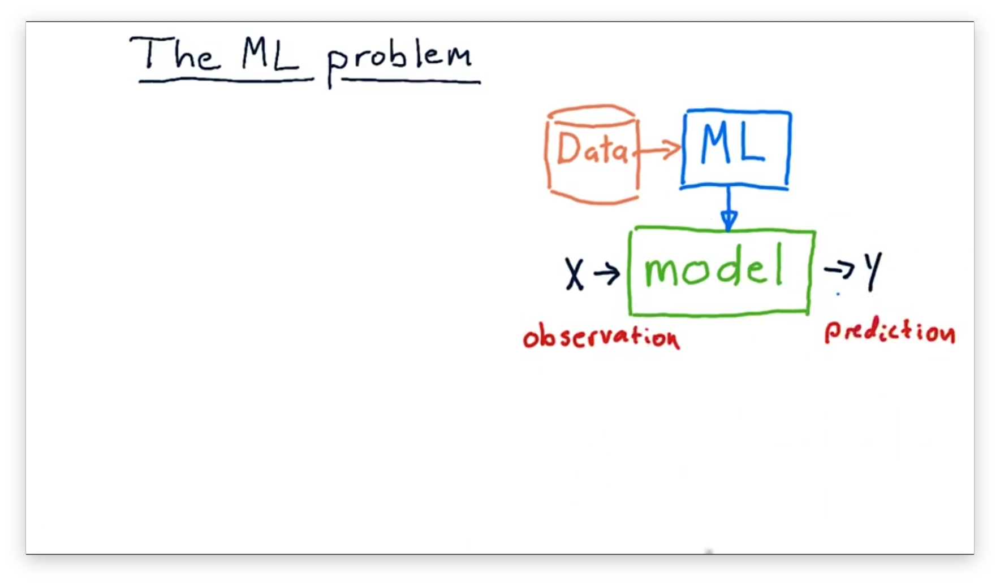
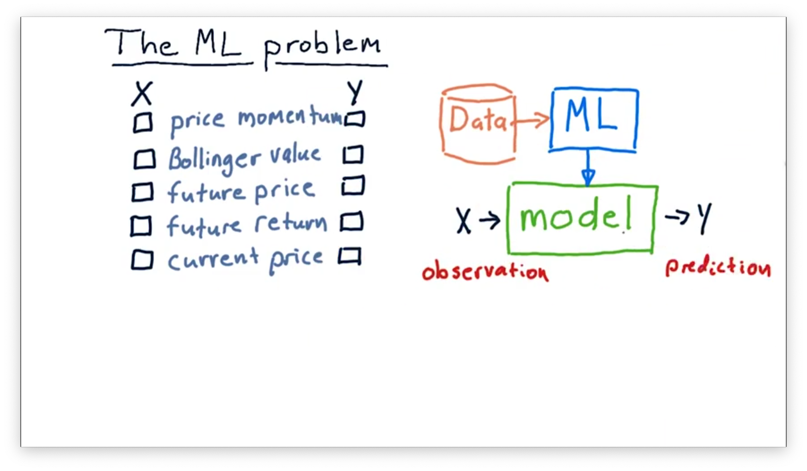
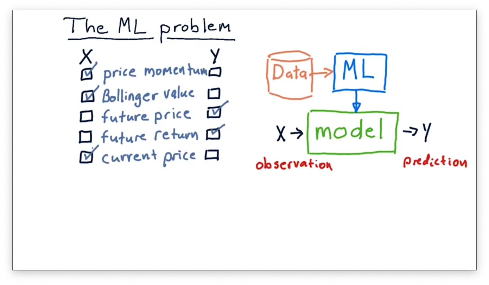

# How Machine Learning is Used at a Hedge Fund

## The ML Problem

In most cases, we use machine learning algorithms to build a model. A **model** is basically a function: it receives an input $X$ and produces an output $Y$. 

Typically, $X$ is some observation or set of observations that we have taken. The model processes the input and produces the output, which is commonly a prediction about the world. For example, X might be some features about stocks, and Y might be the future price of that stock.

X can be multidimensional; in other words, there might be multiple factors that we are considering. Might be bollinger bands, P/E ratio and so on. Y is typically single dimensional, and just represents the single dimension prediction that we are trying to make.

There are many lots of models that people have built that don't use machine learning at all. One example is the Black Schoale's model that predicts options prices. There are many examples of models that people build using mathematical models, but in machine learning we are trying to use data.

The machine learning process involves taking historical data, running it through a machine learning algorithm of some sort to generate the model. Then, at runtime, or when we need to use the model, we push x's into it and y's come out.

## What's X and Y Quiz

Let's consider that we wanted to build a model and use it in trading. Which factors might you consider as inputs or X's and which might you consider as outputs of Y's for our model?

## What's X and Y Quiz Solution

Both future price and future return make sense as outputs of our model, as we are often trying to predict values in the future. To make this prediction, our model might take in price momentum, current price, and Bollinger values as input.

## Supervised Regression Learning

## Robot Navigation Example

Watch the full video [here](https://www.youtube.com/watch?v=XCE7_OfSkFI).