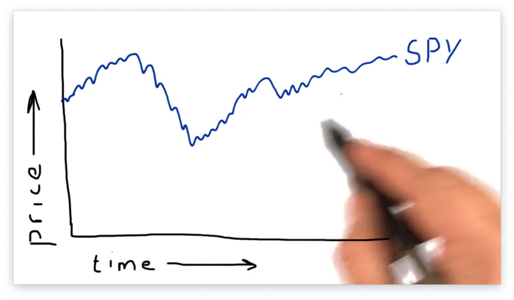
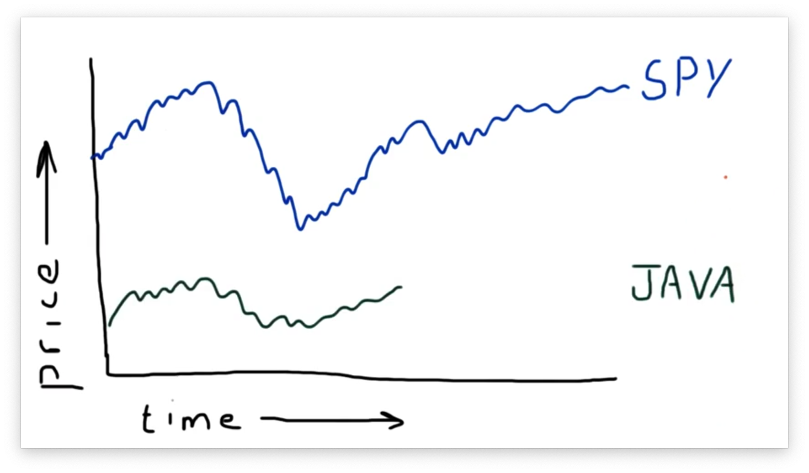
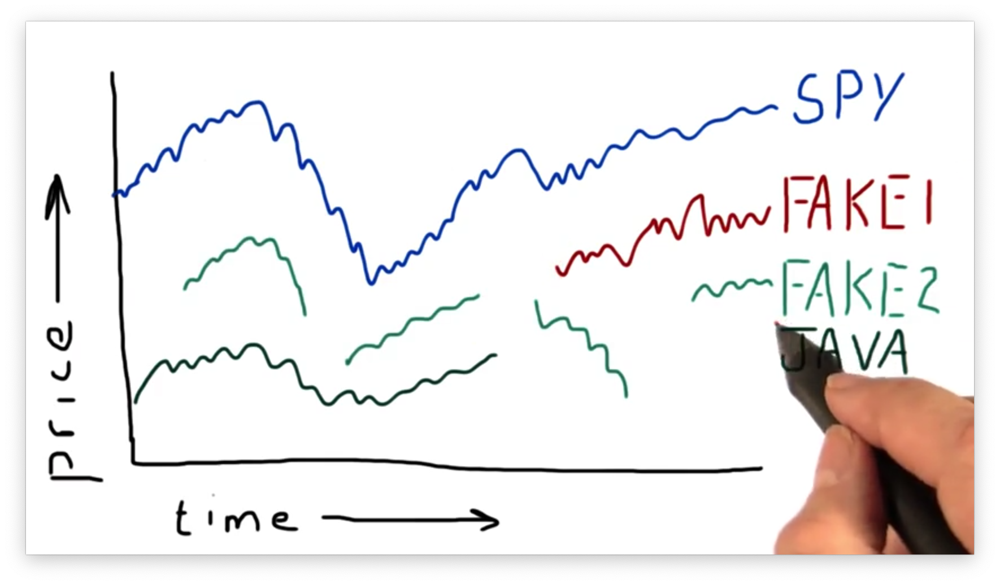

# Incomplete Data

## Pristine Data

People have many misconceptions when it comes to financial data, and one of the biggest is that the data is always pristine. People often imagine that financial data is perfectly recorded, minute by minute, free of gaps and other errors.

That's just not the case.

For example, a stock might be traded on multiple exchanges - the New York Stock Exchange, the NASDAQ, and [BATS](/Users/mschlenker/src/omscs-notes/notes/machine-learning-trading/incomplete-data.md), among others. At any particular minute during the day, it may trade at one price on one exchange, and a different price on another.

As a result, there is no single price for a stock at a particular time, and it's hard to say which exchange is "right" when it comes to pricing a stock. The reality of the data that we get is that it's often an amalgamation from several different sources, and different data providers supply different numbers.

Additionally, not all stocks trade every day, so we can see gaps in our data in between periods of activity. Additionally, stocks come into and go out of existence, so we might see data for a stock suddenly begin or end.

## Why Data Goes Missing

Let's consider the following plot of SPY pricing data.

SPY, an [ETF](https://en.wikipedia.org/wiki/Exchange-traded_fund) that tracks the S&P 500, is one of the most liquid and actively-traded ETFs on the market. Because of its frequent trading, we typically use SPY as a proxy for the stock market being open and as a time and date reference for other stocks.

Let's look at another stock: JAVA.

As we can see, JAVA was trading from the beginning of our time frame but then abruptly stopped. The reason for this is that Sun Microsystems, trading under the ticker JAVA, was acquired by Oracle in 2010. On that day, the JAVA ticker ceased to exist. From this date forward, all data for JAVA will be `NaN`.

Interestingly, before JAVA represented Sun Microsystems, it was the ticker for Mr. Coffee. If you look historically for data for JAVA, you'll find two different time series for the ticker: one for Mr. Coffee, and one for Sun Microsystems.

Let's look at another, admittedly fake, stock: FAKE1.

As you can see, FAKE1 didn't exist before a date roughly in the middle of our range. While we see `NaN` values *after* a particular date for JAVA, we see `NaN` values *before* a particular date for FAKE1.

Let's look at a second fake stock: FAKE2.

We can see that, in addition to not having data at the beginning of the range, FAKE2 also has serious gaps in the data throughout the range. This data is not typical for a very large, liquid stock like GOOG or APPL, but can be typical for thinly traded stocks, such as those that have a smaller market capitalization and trade infrequently.

## Why this is Bad / What we can Do

## Pandas fillna() Quiz

## Pandas fillna() Quiz Solution

## Using fillna()

## Fill Missing Values Quiz

## Fill Missing Values Solution
