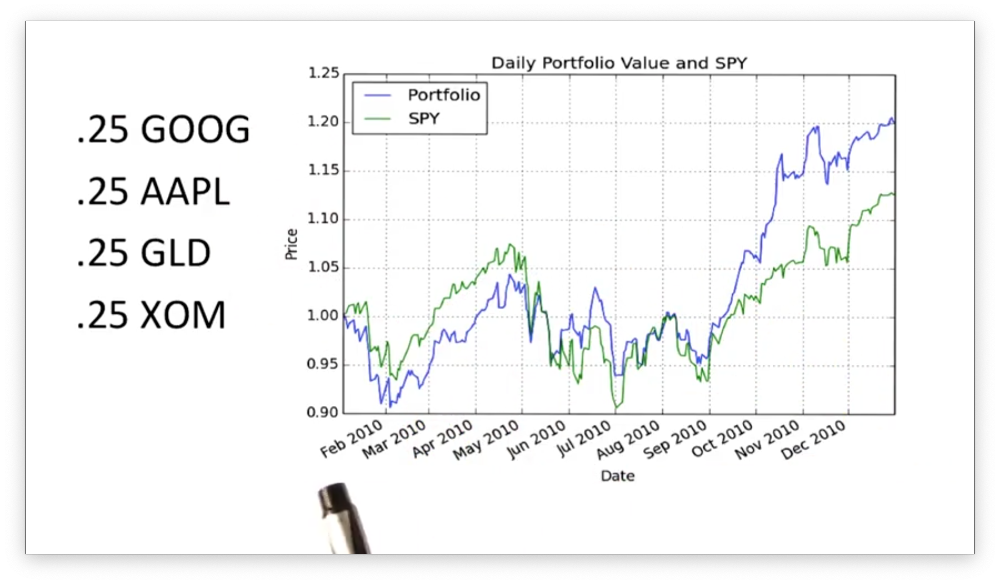
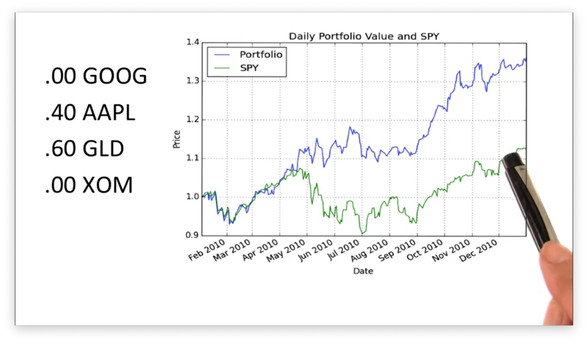
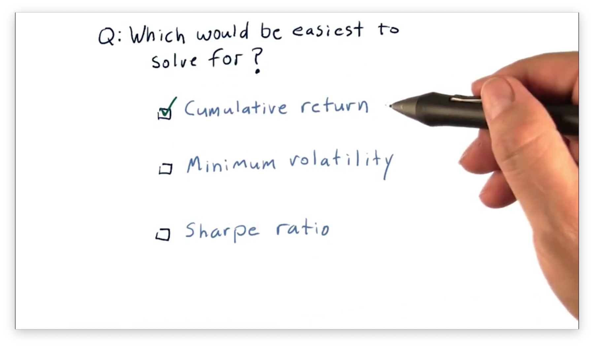

# Optimizers: How to Optimize a Portfolio

## What is Portfolio Optimization

Given a set of assets and a time period, **portfolio optimization** seeks to find an allocation of funds to assets that maximize performance. We can choose to optimize for one of several different performance metrics, such as cumulative return, volatility/risk, or Sharpe ratio.

## The Difference Optimization can Make

Consider this portfolio, which contains equal allocations to four stocks - GOOG, AAPL, GLD, and XOM - held from the beginning to the end of 2010.

Note that the performance of this unoptimized portfolio, plotted in blue, outperforms SPY, plotted in green.

Let's optimize this portfolio for Sharpe ratio and see how the returns change.

We can see that this optimized portfolio outperforms both SPY and the previous, unoptimized portfolio. 

Note the blend of asset allocations required for this performance. Whereas before we had equal allocations between assets, here we have a 40/60 split between AAPL and GLD, with GOOG and XOM receiving no allocation.

Of course, it's easy to go into the past and optimize for values that we know. The important question is: does this type of optimization help us in the future? Indeed, if we optimize our portfolio for Sharpe ratio and reoptimize, or **rebalance**, our allocations month by month, we often see higher returns than we would have if we stuck with equal allocations.

## Which Criteria is Easiest to Solve For Quiz

Let's assume we have a portfolio of four stocks, and we want to find the optimal allocations that maximize some performance metric. Which of the following metrics would be easiest to optimize for?

## Which Criteria is Easiest to Solve For Quiz Solution

It would be easiest to write an optimizer for cumulative return. To do so, all we need to do is allocate 100% of our portfolio into whichever stock had the highest cumulative return. 

Optimizing for minimum volatility or Sharpe ratio involves evaluating various combinations of stocks, which is more complicated than simply putting all our eggs in one basket.

## Framing the Problem

## Ranges and Constraints

