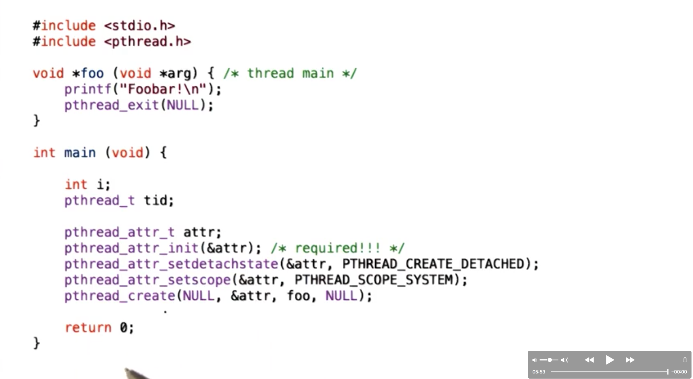
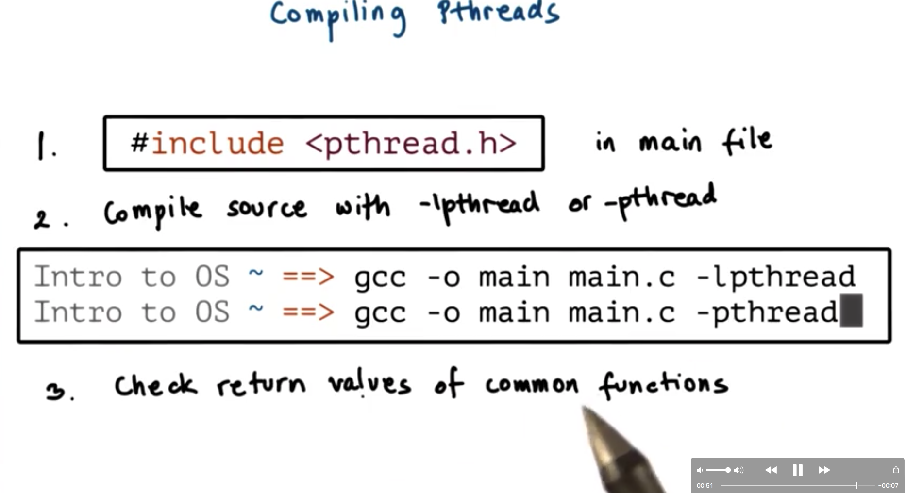
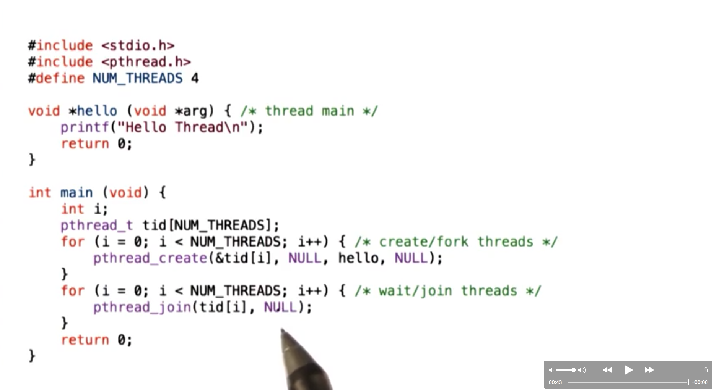
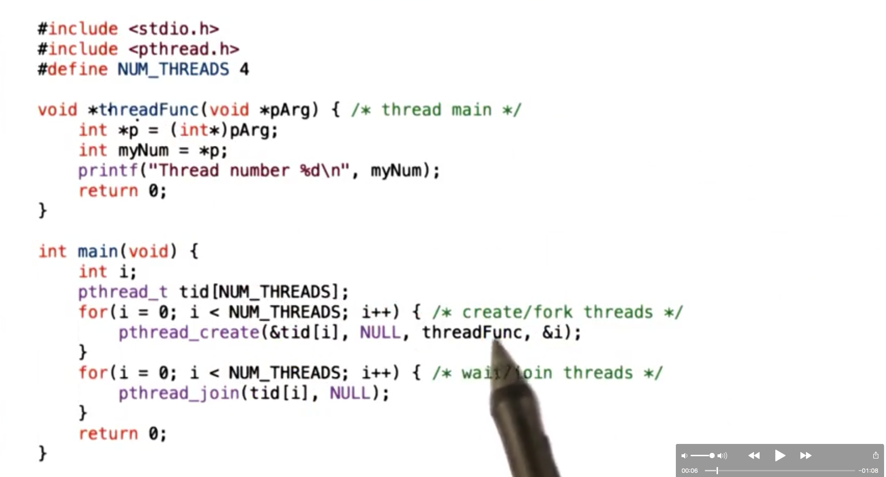
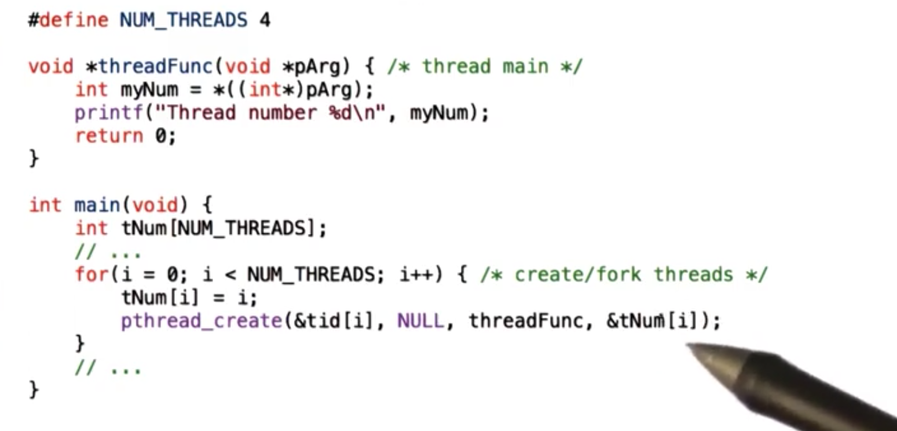
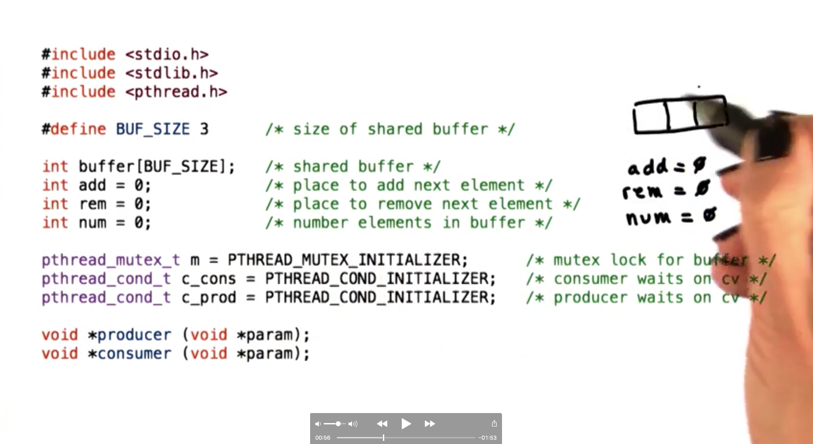
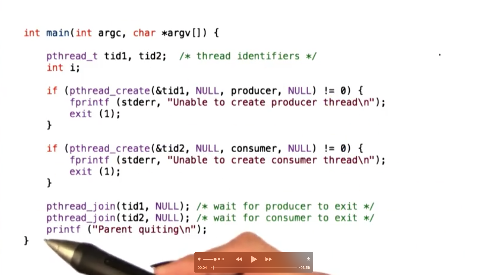
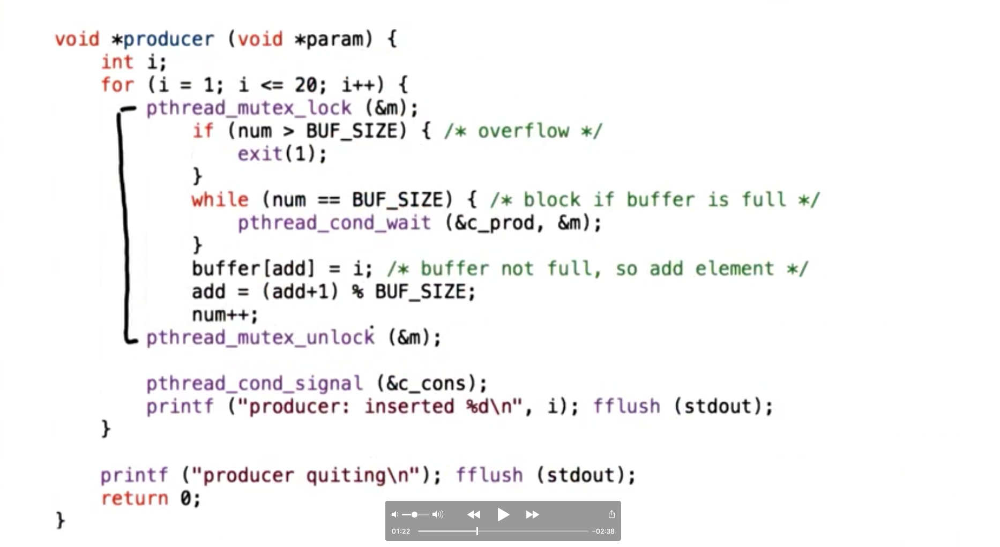
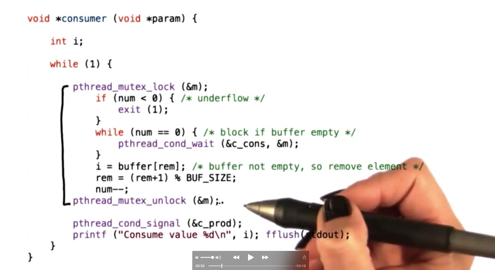

## PThread Creation

To represent threads, pthreads supports a `pthread_t` data type. Variables of this type will by uniquely identified by an identifier and will describe a thread.

Threads are created by the following function

```c
int pthread_create(pthread_t *thread, const pthread_attr_t *attr, void * (*start_routine)(void *), void *arg);
```

This function takes as arguments a pointer to a `pthread_t`, a well as a start routine and an argument to pass to that start routine.

It also takes an argument which is of the type `pthread_attr_t` which is a data structure that can be used to set various options on the thread during creation.

`pthread_create` returns an `int` which indicates whether the creation was a success or a failure.

Child threads can be joined back to a parent thread with

```c
int pthread_join(pthread_t thread, void **status);
```

This function takes the thread to be joined as well as a status variable. The status variable will capture all of the important return information that is returned from the thread to be joined.

`pthread_join` returns an `int` which indicates whether the join was a success or a failure.

The `pthread_attr_t` data structure allows us to define features of the new thread we are creating, such as:

* stack size
* scheduling policy
* priority
* system/process scope
* inheritance
* joinable

If `NULL` is passed in the place of a `pthread_attr_t`, pthreads falls back to default behavior for the new thread.

There are several calls that allow us to operate on a `pthread_attr_t`

```c
int pthread_attr_init(pthread_attr_t *attr);
int pthread_attr_destroy(pthread_attr_t *attr);
pthread_attr_{set/get}{attribute};
```

These functions can be used, respectively, to allocate space for a `pthread_attr_t`, to deallocate space for that `pthread_attr_t` and to set/get various attributes of that structure.

One mechanism not considered by Birrell is **detachable threads**. In pthreads, the default behavior for thread creation is joinable threads. For a joinable \(child\) thread, the parent will not terminate until the child has completed their execution. If the parent thread exits early, the child threads may turn into zombies.

In pthreads, it is possible to allow child threads to become detached. Detached threads cannot be joined back into the parent, allowing the parent to exit early and the child threads to continue their execution.

To detach threads, use

```c
int pthread_detach(pthread_t thread);
```

Or

```c
pthread_attr_setdetachstate(attr, PTHREAD_CREATE_DETACHED);

// ...

pthread_create(..., attr, ...);
```

Since parent threads do not need to wait around until child threads complete, they can simply exit with `pthread_exit`.

Example of creating a new thread with custom options:



## Compiling PThreads



## PThread Creation Example 1



We loop and create threads with `pthread_create` passing in `hello` as the start routine. Since this function takes no arguments we pass `NULL` as the fourth argument to the function. Also, since we do not need any custom behavior, we pass `NULL` as the second argument. After we create the threads we must join them all back in.

## PThread Creation Example 2



In this case, the call to `pthread_create` passes in a value for the final parameter \(the argument to pass to the start routine\). This value is the pointer to current value of `i` the loop counter. In `threadFunc`, the pointer is first cast to an integer pointer, before a local variable is assigned to the value the pointer points to. Finally, the value is printed out.

## PThread Creation Example 3

This section explains how this is a valid input for the example above

```text
Thread Number 0
Thread Number 2
Thread Number 2
Thread Number 3
```

The variable `i` that is used in thread creation in the example above is a globally visible variable that is defined in `main`. When its value changes in one thread, all the other threads will see the new value.

In this particular case, the second thread that is created with `pthread_create` is created when `i == 1`. In the thread function, `p` will become equivalent to the address of `i` and `myNum` will take on the value of `i`, which is presumably 1.

However, it is possible that before this thread had the chance to cast the pointer and define a local variable pointing to the pointer’s value, the main thread went into the next iteration of the `for` loop and incremented `i`, making `i` now 2. Since we pass the address of `i` to the start routine, `p` will still point to the address of `i`, but `myNum` will point to the \(new\) value of `i`, which is 2.

We call the above situation a **data race** or **race condition**. In summary, these terms refers to situations in which one thread tries to read a value that another thread is modifying.

To correct the problem, we must first initialize an array `tNum` that contains as many elements as we have threads. One each iteration of the `for` loop, we can set the index of `tNum` at `i` to `i`. We can then pass the address of `tNum[i]` to the call to `pthread_create`. This way we can increment `i`, while ensuring that the value of `i` that a thread needs to see does not change. We accomplish by copying the value of `i` over to this private storage that we do not modify.



## PThread Mutexes

To deal with the mutual exclusion problem, pthreads supports mutexes. Mutual exclusion ensures that threads access shared state in a controlled manner, such that only thread at a time can apply modifications or otherwise access that shared variable.

In pthreads, the mutex data structure is represented via a `pthread_mutex_t` type.

In pthreads, there is no implicit unlock: both lock and unlock must be explicitly called.

```c
int pthread_mutex_lock(pthread_mutex_t *mutex);
int pthread_mutex_unlock(pthread_mutex_t *mutex);
```

Whatever code appears between these two statements will correspond to the _critical section_.

Mutexes must be explicitly initialized, as with the following function

```c
int pthread_mutex_init(pthread_mutex_t *mutex, const pthread_mutexattr_t *attr);
```

The `pthread_mutexattr_t *attr` argument allows us to specify the behavior that we want the mutex to have. Passing `NULL` gives us the default behavior \(similar to the case with `pthread_create` and `pthread_attr_t`\).

Another interesting operation that can used on mutexes is

```c
int pthread_mutex_trylock(pthread_mutex_t *mutex);
```

Unlike `pthread_mutex_lock` which will cause the calling thread to block, this function will return immediately if the mutex cannot be acquired.

Mutexes can be destroyed \(freed\) with

```c
int pthread_mutex_destroy(pthread_mutex_t *mutex);
```

### Mutex Safety Tips

* shared data should always be accessed through single mutex
* mutex scope must be global
* globally order locks
  * lock mutexes in order \(to prevent deadlocks\)
* always unlock the \(correct\) mutex

## PThread Condition Variables

Condition variables are synchronization mechanisms that allow blocked threads to be notified when a certain condition occurs.

In pthreads, condition variables are represented by the `pthread_cond_t` data type.

To wait on a condition variable, we can call

```c
int pthread_cond_wait(pthread_cond_t *cond, pthread_mutex_t *mutex);
```

When a thread enters this function, it immediately releases the mutex and places itself on the wait queue associated with the condition variable. When the thread is woken up, it will automatically reacquire the mutex before exiting the wait operation.

To signal or broadcast on a condition variable we call

```c
int pthread_cond_signal(pthread_cond_t *cond);
int pthread_cond_broadcast(pthread_cont *cond);
```

To allocate/create a condition variable and de-allocate/destroy a condition variable, we can call

```c
int pthread_cond_init(pthread_cond_t *cond, const pthread_condattr_t *attr);

int pthread_cond_destroy(pthread_cond_t *cond);
```

`pthread_cond_init` takes some attributes that can further specify the behavior of the condition variable \(much like we saw with `pthread_create` and `pthread_mutex_init`\). As before, setting this value to `NULL` gives us the default behavior.

### Condition Variable Safety Tips

* Don’t forget to notify waiting threads!
  * When a condition changes, make sure to signal/broadcast the correct condition variable
* When in doubt use broadcast!
  * Using broadcast incorrectly can incur a performance loss, but using signal incorrectly make cause your program to execute incorrectly.
* You don’t need a mutex to signal/broadcast
  * May be best to notify after unlocking mutex to prevent spurious wake ups.

## Producer and Consumer Example

Let’s walk through a real producer/consumer example using PThreads.

### Global State



Our shared buffer is `buffer`. `add` and `rem` refer to the indices at which we add and remove elements, respectively, while `num` refers to the number of elements in the queue.

These shared variables are used in conjunction with our mutex `m` and our condition variables `c_cons` and `c_prod` which are all initialized here.

Finally, we define our two procedures: `producer` which will be operated by the producer thread and `consumer` which will be executed by the consume threads.

### Main



The first thread that we create will be created to execute the `producer` function, and the second thread we create will execute the `consumer` function.

We use the default behavior for these threads \(i.e. they are not detachable\), so we must make sure to `pthread_join` them before `main` returns.

### Producer



The producer loops twenty times, and tries to produce an element to the share buffer on each iteration.

It tries to accomplish this by first acquiring `m` with `pthread_mutex_lock`. Once `m` is acquired, the producer will potentially wait on `c_prod` with `pthread_cond_wait` if the shared buffer is full \(`num == BUFSIZE`\). Otherwise, the producer will add its element to the buffer, and update the three shared variables to reflect this addition.

Once the producer unlocks the mutex, it signals on `c_cons` with `pthread_cond_signal` to let the consumers know that there is data to consume.

### Consumer



The consumer loops forever, continuously trying to remove elements from the shared buffer.

It tries to accomplish this by first acquiring `m` with `pthread_mutex_lock`. Once `m` is acquired, the consumer will potentially wait on `c_cons` with `pthread_cond_wait` if the shared buffer is empty \(`num == 0`\). Otherwise, the consumer will remove an element from the buffer, and update the three shared variables to reflect this removal.

Once the consumer unlocks the mutex, it signals on `c_prod` with `pthread_cond_signal` to let the producer know that there is space in the buffer to add more data.
